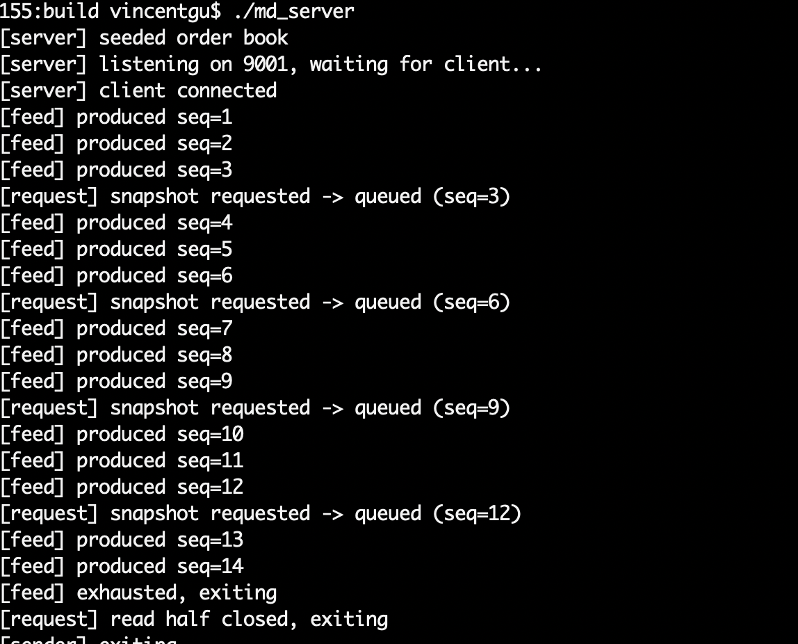
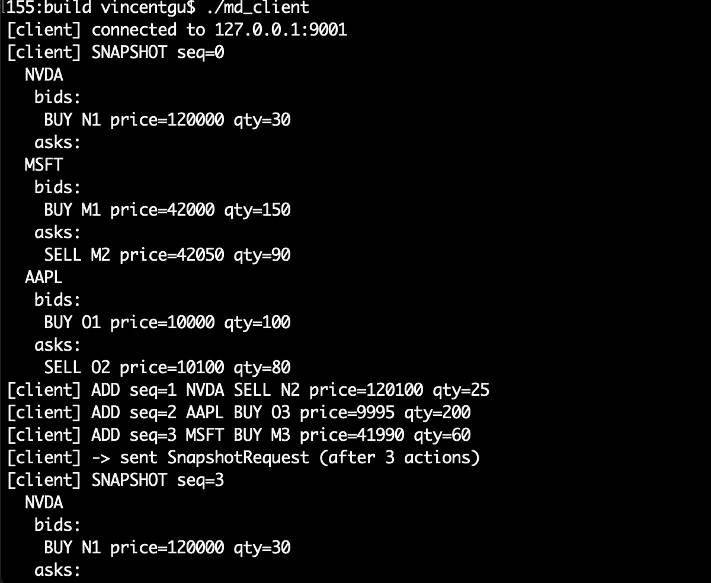

# Market Data Dissemination Simulator

An exchange-style market data feed in C++. A server maintains a live L2 (price-level) order
book and streams it to a subscribing client over **raw TCP** (POSIX sockets).

## Server threads

The server runs **three threads** sharing one outgoing message queue protected by a
**spinlock**:

| Server thread | Role |
|---|---|
| Market-data feed listener | Reads simulated market events (add / modify / remove a price level) and applies them to the authoritative order book, then enqueues the delta |
| Client-request listener | Reads `SnapshotRequest`s from the client and enqueues a full snapshot of the current book |
| Sender | Sole socket writer — drains the queue, frames each message (4-byte big-endian length + protobuf), and `send()`s it |

## Client

The client receives an order-book update per market action, and can also request a current
order-book snapshot at any time on the same socket.

## Build & run

Requires CMake ≥ 3.20, a C++20 compiler, and protobuf (`brew install protobuf`).

```bash
cmake -S . -B build
cmake --build build
cd build
./md_server            # terminal 1: seeds the book, listens on port 9001
./md_client [host]     # terminal 2: connects (default 127.0.0.1)
```

## Sample output

| Server — streams events, answers snapshot requests | Client — mirrors the book from snapshot + deltas |
|---|---|
|  |  |
